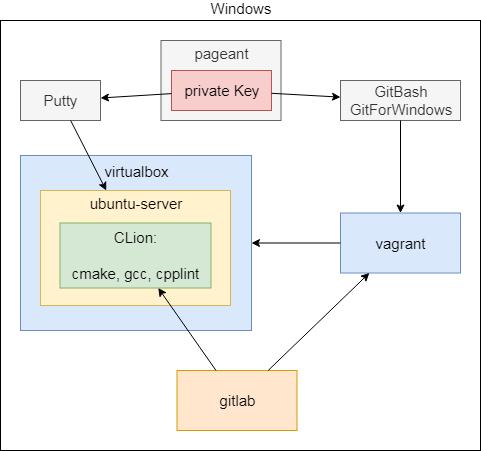
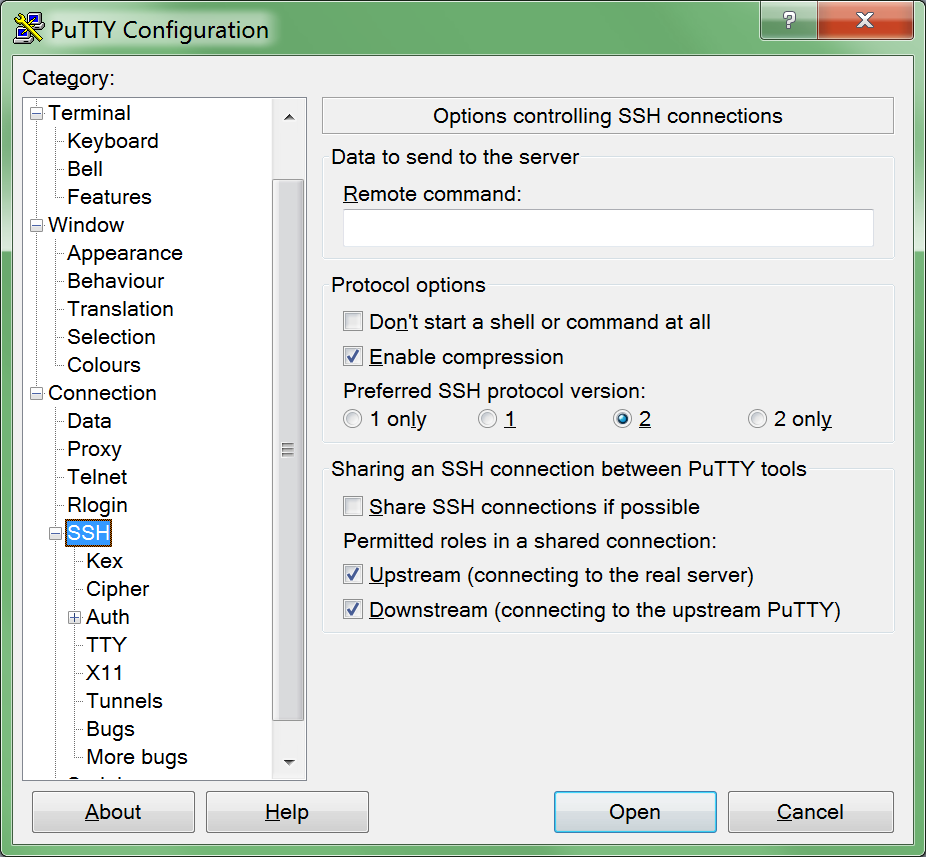
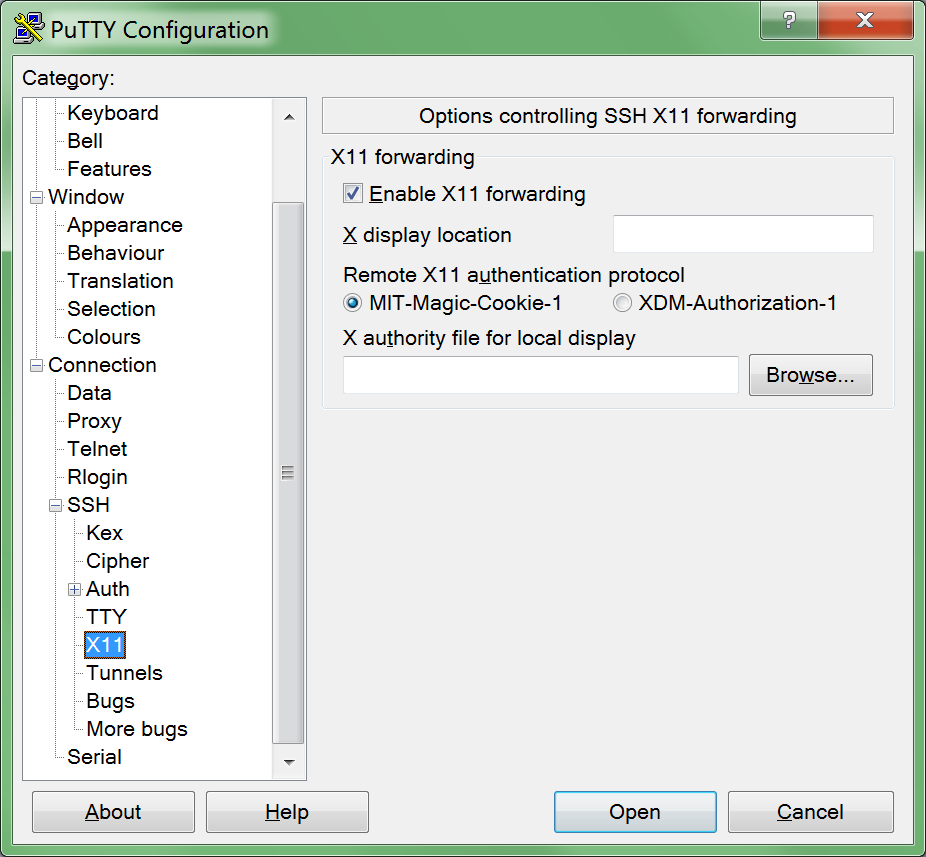
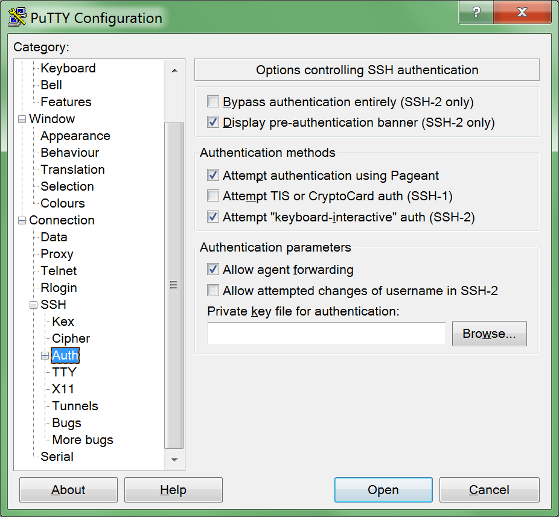
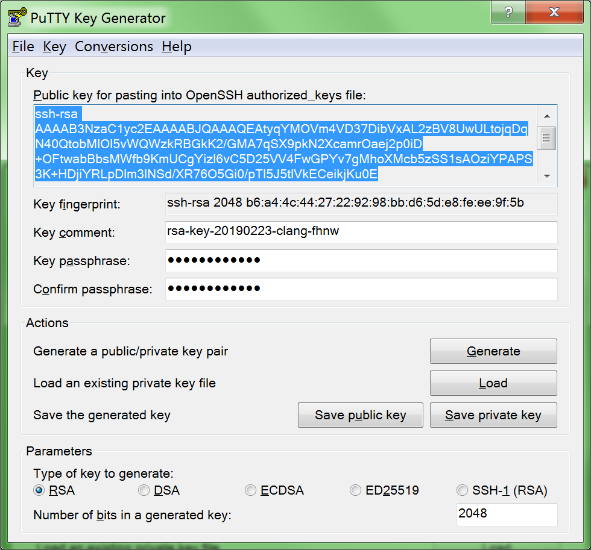
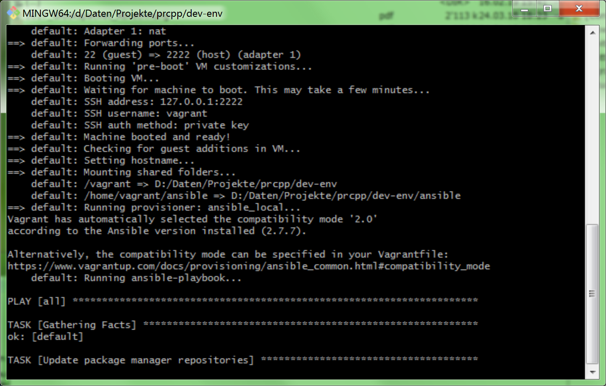
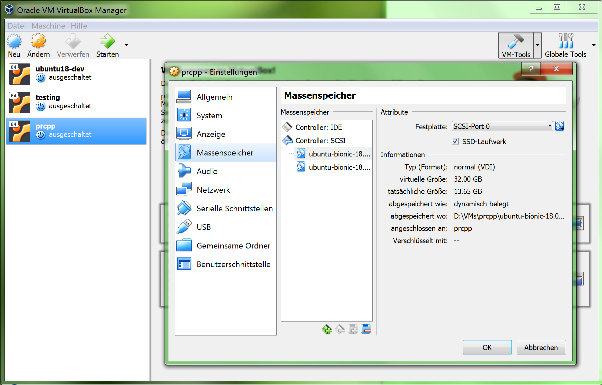

Entwicklungs-Umgebung
=====================

Um die Einrichtung einer einheitlichen Entwicklungsumgebung zu vereinfachen,
nutzen wir `vagrant` um automatisiert eine VM aufzusetzten. Dies funktioniert
ähnlich wie `docker` mittels dem `Vagrantfile`. Für das Installieren aller Tools
(Provisioning) wird `ansible` verwendet.

Übersicht & Konzept
-------------------

* Virtualbox Ubuntu-Server-VM mit allen Entwicklungs-Tools
* VM durch `vagrant` und `ansible` automatisiert
* SSH via Putty mit SSH-Key für alles
* Source Code wird über gitlab zur Verfügung gestellt
* CLion als IDE
* `cmake` als Build-System
* Google C++ Code Style

Einschränkungen
---------------

* Basis ist immer `cmake`
* `cpplint` -> python
* SSH-Key

Freiheiten
----------

* IDE
* Betriebssystem
* Git-Client

Google C++ Code Style
---------------------

* [Google C++ Style Guide](https://google.github.io/styleguide/cppguide.html)
* [github.com/cpplint/cpplint](https://github.com/cpplint/cpplint)
* Python-Runtime
* Forciert durch Build-System
* Zudem forcierte Warnings
* Automatisierter Lerneffekt

Vorteile einer Entwicklungs-VM
------------------------------

* einheitliche Umgebung
* auf jedem Host-System (Windows, Linux, OSX) lauffähig
* vorinstallierte Libraries und Tools: `catch2`, `CLion`, `valgrind`, etc.
* vorinstallierte git-Tools: `gitk`, `git-gui`, `git-prompt`, `git-pdf`
* VM kann bei Defekt einfach zerstört und neu aufgebaut werden
* Nachteil: Erschwerter Datei-Austausch (siehe unten)

Einrichten
==========

In dieser Anleitung gehen wir Schritt für Schritt durch das Einrichten der
Entwicklungsumgebung durch. Die hier beschriebenen Tools etc. sind für eine
Windows-Umgebung vorgesehen, sollten aber auch ähnlich unter Linux oder OSX
funktionieren oder es sind entsprechende Alternativen verfügbar.

Putty & SSH-Key
---------------

Für das Einloggen in die VM und für die Git-Repositories wird ein SSH-Key
benötigt. Dieser wird am einfachsten mit den Tools in Putty erstellt. Putty
selber wird als SSH-Client verwendet.

### Putty installieren

* Laden Sie Putty herunter: [Putty](https://www.putty.org/)
* Installieren Sie Putty mit Standard-Einstellungen

### Putty Session einrichten

* Starten Sie Putty
* Stellen Sie folgende Daten ein:
  * SSH -> Enable compression
  * SSH -> Cipher -> Setzten Sie `Arcfour` an die erste Stelle der Liste
  * SSH -> X11 -> Enable X11 forwarding
  * SSH -> Auth -> Allow agent forwarding
  * Session -> Host Name: `vagrant@localhost`
  * Session -> Port: `2222`
  * Session -> Saved Sessions: `prcpp`
* Klicken Sie auf `Save`
* Die gespeicherte Session können Sie später für die Verbindung zur
  VM verwenden.

### SSH-Key generieren

SSH ist seit längerem ein zentrales Element für sicheren Datenaustausch.
Um das mühselige und unsichere Nutzername/Passwort-Schema zu ersetzten wird
meistens eine Public-Private-Key Authentisierung verwendet. Dazu müssen wir
ein entsprechendes Key-Paar erstellen.

* Öffnen Sie den Key-Generator welcher mit Putty installiert wurde.
  Meistens unter: `c:\Program Files\PuTTY\puttygen.exe`
* Stellen Sie folgende Optionen unten im Fenster "Parameter" ein:
  Type: `RSA`, Number of Bits: `2048`
* Wählen Sie im Menu `Key` den Punkt `SSH-2 RSA Key` und starten Sie den
  Vorgang mit `Generate Key Pair`
* Mittels Mausbewegung im Fenster werden Random-Zahlen generiert, welche
  zur Erzeugung des Keys verwendet werden.
* Geben Sie nach diesem Vorgang eine `Passphrase` ein, um ihren
  Key zu schützen.
* Im `Key comment` Feld können Sie zur leichteren Erkennung eine Ergänzung
  vornehmen. Z.B: `rsa-key-20190223-clang-fhnw` Diese Bezeichnung verwenden
  Sie im Folgenden auch für die Dateinamen.
* Speichern Sie den Putty public Key mittels `Save public Key` an einem
  sicheren Ort mit Endung: `.pub`
* Speichern Sie den Putty private Key mittels `Save private Key` an einem
  sicheren Ort mit Endung: `.ppk`
* Mittels `Conversion` -> `OpenSSH key` speichern Sie den OpenSSH
  private Key mit der Endung: `.opriv`
* Den kompletten Inhalt im Fenster speichern Sie mittels Text-Editor mit
  der Endung: `.opub`. Dies ist der OpenSSH public Key.

### SSH-Key bei gitlab registrieren

Den OpenSSH public Key können Sie nun in gitlab als sicheren Schlüssel
registrieren: `User Settings` -> `SSH Keys`. Kopieren Sie einfach den
kompletten Inhalt der `.opub` Datei in die entsprechende Text-Box.

### Private Key verwenden

Damit Sie sich in gitlab oder auch der VM mittels
Private-Public-Key-Verschlüsselung einloggen können, muss der entsprechende Client eine
Möglichkeit haben, um den private Key zu benutzten. Dies bewerkstelligen wir
mit dem Tool `pageant.exe` welches ebenfalls mit Putty installiert wurde.

Damit dieser Key-Agent jeweils beim Windows-Start gestartet wird, erstellen
wir eine entsprechende Verknüpfung zu `pageant.exe`.

* Drücken Sie `Win + r` für den Ausführen Dialog
* Geben Sie `shell:Startup` ein und drücken OK
* Erstellen Sie im geöffneten Ordner eine neue Verknüpfung mittels:
  `Rechtsklick` -> `Neu` -> `Verknüpfung`
* Geben Sie folgendes Ziel inkl. Parameter ein. Passen Sie bei Bedarf
  den Pfad zum Binary und auch zu ihrem eigenen private Key an.

~~~
"C:\Program Files\Putty\pageant.exe" "d:\Daten\Keys\rsa-key-20190223-clang-fhnw.ppk"
~~~

`pageant.exe` wird nun bei jedem Windows-Start automatisch aktiv. Er erscheint
als kleines Desktop-Symbol in der Taskleiste. Sollten Sie ihren private Key
mittels Passwort gesichert haben, wird er Sie jeweils beim Aufstarten
einmalig danach fragen.

X11-Server
----------

Damit wir die grafischen Oberflächen der Tools in der Linux-VM später auf dem
Windows-Desktop nutzen können, müssen wir einen entsprechenden X11-Server
auf Windows installieren.

* Laden Sie ihn hier herunter: [VcXsrv](https://sourceforge.net/projects/vcxsrv/)
* Installieren Sie ihn mit Standard-Einstellungen
* Starten Sie den X-Server mittels der Verknüpfung auf dem Desktop und
  wählen Sie `Multiple Windows`
* Alle weiteren Optionen sollten Sie ebenfalls auf Default belassen.

Wenn Sie den X-Server später automatisch beim Windows-Startup starten möchten,
erstellen Sie eine entsprechende Verknüpfung zu `vcxsrv.exe`.

* Drücken Sie `Win + r` für den Ausführen Dialog
* Geben Sie `shell:Startup` ein und drücken OK
* Erstellen Sie im geöffneten Ordner eine neue Verknüpfung mittels:
  `Rechtsklick` -> `Neu` -> `Verknüpfung`
* Geben Sie folgendes Ziel inkl. Parameter ein. Passen Sie bei Bedarf
  den Pfad zum Binary an.

~~~
"C:\Program Files\VcXsrv\vcxsrv.exe" :0 -ac -terminate -lesspointer -multiwindow -clipboard -wgl
~~~

Sollte der X-Server evtl. mal abstürzen, können Sie die gleiche Verknüpfung nochmals
auf dem Desktop erstellen, damit Sie den X-Server bei Bedarf manuell starten können.

Git für Windows / Git Bash
--------------------------

Die Skripts für das automatische Erstellen der VM sind im
Git-Repository verfügbar. Um dieses auszuchecken wird ein entsprechender
Git-Client unter Windows benötigt. Zudem dient dieser später auch als
Bash-Konsole um `vagrant` zu bedienen.

* Laden Sie Git Bash herunter: [gitforwindows.org](https://gitforwindows.org/)
* Starten Sie die Installation und wählen Sie jeweils folgende Optionen:
  * Default Editor: `nano`
  * `Use Git from Git Bash only`
  * `Use (Tortoise)Plink`. Hier wählen Sie den Pfad zur `plink.exe`. Auch
    diese Tool wurde bereits mit Putty installiert und befindet sich
    typischerweise unter: `c:\Program Files\PuTTY\plink.exe`
  * `Use the OpenSSL library`
  * `Checkout as-is, commit UNIX-style line endings`
  * `Use MinTTY`
  * `Enable file system caching`
  * Deaktivieren Sie UNBEDINGT: `Enable Git Credential Manager`
* Alle anderen Optionen belassen Sie beim Default.

Git Bash ist nun eingerichtet und so konfiguriert, dass es mittels OpenSSH
arbeitet und für die Verschlüsselung den `pageant.exe` von Putty verwendet.

Virtualbox
----------

Wir verwenden Virtualbox 6 as Hypervisor für die VM.
[VirtualBox Downloads](https://www.virtualbox.org/wiki/Downloads)

Vagrant
-------

Vagrant erlaubt die automatische instanzierung von VMs. Zudem erlaubt es mittels
unterschiedlichen Tools die Installation aller nötigen Packete innerhalb
einer solchen VM. Wir verwenden dazu das integrierte `ansible`.

* Laden Sie Vagrant herunter: [vagrantup.com](https://www.vagrantup.com/)
* Installieren Sie es mit Default Einstellungen.
* Starten Sie Git Bash und installieren Sie das benötigte Vagrant Plugin
  mittels:
  
~~~
vagrant plugin install vagrant-disksize
~~~

### Powershell 3.0 (nur Windows 7)

Sollten Sie noch ein Windows 7 betreiben, müssen Sie zudem Powershell
in Version 3.0 installieren. Diese können Sie unter folgendem Link
herunterladen: [Windows Management Framework 3.0](https://www.microsoft.com/en-us/download/details.aspx?id=34595)

Weitere Informationen bei Problemen finden Sie 
[hier](https://blogs.technet.microsoft.com/heyscriptingguy/2013/06/02/weekend-scripter-install-powershell-3-0-on-windows-7/).

Erste Verbindung mit gitlab
---------------------------

Da wir Git Bash mittels OpenSSH und `pageant.exe` betreiben, müssen wir
den Host-Hash des Servers akzeptieren. Leider ist dies beim Klonen mittels
Git Bash nicht möglich (Bug) und muss deshalb einmalig mittels Putty
erledigt werden.

* Starten Sie Putty
* Verbinden Sie sich mit: `git@gitlab.fhnw.ch`
* Akzeptieren Sie den Host-Hash im auftauchenden Fenster
* Schliessen Sie Putty

Bemerkung: Es ist normal, dass Sie sich scheinbar einloggen können, 
sich die Shell aber direkt wieder abmeldet.

Entwicklungs-VM
===============

Klonen des Repositories für die Entwicklungsumgebung
----------------------------------------------------

Nun können wir das nötige Git-Repository klonen. Starten Sie dazu Git Bash.

~~~
cd
mkdir prcpp && cd prcpp
git clone git@gitlab.fhnw.ch:prcpp/students/dev-env.git
cd dev-env
git checkout -b private/<my_name>
~~~

Nun haben Sie das Repository ausgecheckt und einen privaten Branch erstellt,
auf welchem Sie ihre Änderungen commiten können. Ersetzten Sie <my_name>
durch ihren Namen: z.B: christian_lang. Sollten Updates auf dem master Branch
publiziert werden, können Sie ihren Branch folgendermassen darauf rebasen:

~~~
git checkout master
git pull
git checkout -
git rebase master
~~~

VM personalisieren
------------------

Bevor Sie nun `vagrant` starten, sollten Sie die VM personalisieren.
Ändern Sie dazu folgende Dateien:

* `dev-env/Vagrantfile`: Ändern Sie nach Bedarf:
  `config.disksize.size`, `vb.memory` und `vb.cpus`
* `dev-env/ansible/roles/ssh/files`: Kopieren Sie ihren public Key
  mit Endung `.opub` in diesen Ordner
* `dev-env/ansible/playbook.xml`: Ändern Sie die Zeile `ssh_pub_files:`
  um ihr eigenes File zu verwenden.
* `dev-env/ansible/playbook.xml`: Ändern Sie die Zeilen unter `role: git`
  auf ihren Namen und ihre E-Mail-Adresse

VM erzeugen
-----------

Die Erzeugung dauert ca. 30 Minuten und benötigt eine stabile und schnelle Internet-Verbindung.
Verwenden Sie beim erstmaligen Erzeugen Git Bash mit `Administrator`-Rechten.
Um die Erzeugung zu starten, verwenden Sie folgenden Befehl.

~~~
cd
cd prcpp/dev-env
vagrant up
~~~

Wenn der Prozess abgeschlossen ist, wurde die VM erstellt und mittels
`ansible` alle Applikationen installiert.

Der Benutzer ist immer `vagrant`. Dessen Default-Passwort ist
ebenfalls `vagrant`.

Folgende Tabelle gibt einen Überblick über weitere Befehle von Vagrant.

| Command                 | Explanation                                                                        |
|-------------------------|------------------------------------------------------------------------------------|
|`vagrant up`             |Startup a not running/existing VM. If not existing do also create and provision it. |
|`vagrant halt`           |Stop running VM.                                                                    |
|`vagrant destroy`        |Completely remove the VM and all its corresponding virtual hard drives.             |
|`vagrant up --provision` |Enforce the provisioning while starting up an existing VM.                          |
|`vagrant provision`      |Start provisioning to a running VM.                                                 |

VM Tuning (optional)
---------

Bei Bedarf können Teilaspekte der VM auch nachträglich über das Virtualbox GUI
angepasst werden. Dazu muss die VM gestopp sein.

* HDD Modus der virtuellen Disks auf SSD stellen.
* RAM/CPUs anpassen
* SSH Port im Port-Forwarding der Netzwerkverbindung anpassen.
  Default ist `2222`.

Diese manuellen Anpassungen bleiben nur solange erhalten, wie die VM nur mittels
Virtualbox GUI gestartet wird. Sobald Vagrant für das Starten verwendet wird,
werden alle Einstellungen wieder auf die Werte von Valgrind gesetzt.

Verwendung der VM
=================

Verbinden Sie sich mit der erstellten Session in Putty (`prcpp`) mittels
der laufenden VM.

Jetzt sollten Sie das Arbeits-Repository innerhalb der VM auschecken:

~~~
cd
mkdir prcpp && cd prcpp
git clone git@gitlab.fhnw.ch:prcpp/students/workspace.git
~~~

Einrichten: CLion
-----------------

Für CLion und alle anderen JetBrains Produkte erhalten sie unter
[www.jetbrains.com/student/](https://www.jetbrains.com/student/) eine gratis
Lizenz. Starten Sie CLion mittels `clion&` über die Konsole und richten Sie
diesen ein. Verwenden Sie die Standard-Toolchain.

Arbeiten mit CLion
------------------

| Shortcut               | Explanation                      |
|---                     |---                               |
| `Ctrl` + `Alt` + `l`   | Formatierung                     |
| `Ctrl` + `F9`          | Build                            |
| `Ctrl` + `F10`         | Reload CMake (selber einrichten) |
| `Alt` + `F7`           | Find usage                       |
| `Shift`, `Shift`       | Intelligente Suche               |
| `Ctrl` + `Alt` + `s`   | Settings                         |
| `Ctrl` + `Shift` + `f` | Search all                       |
| `Ctrl` + `Shift` + `r` | Search & Replace all             |

[CLion Reference Card](https://resources.jetbrains.com/storage/products/clion/docs/CLion_ReferenceCard.pdf)

Unittest-Framework:

* [catch2](https://github.com/catchorg/Catch2)
* [blog.jetbrains.com/clion/2017/03/to-catch-a-clion/](https://blog.jetbrains.com/clion/2017/03/to-catch-a-clion/)

Weitere verfügbare Tools
------------------------

* `git gui` (git commit helper)
* `gitk` (git Tree Viewer)
* `valgrind` (Memory Analyzer)
* `nano` (Console Editor)
* `tmux` (Shell Multiplexer)
* `okular` (PDF Viewer)
* `chromium-browser` (Browser)

Rechen-Performance der VM
-------------------------

Damit die VM beinahe native Rechen-Leistung erreicht (wichtig für diverse Aufgaben),
sollten Sie sicherstellen, dass Ihr Rechner alle benötigten Virtualisierungs-Technologien
aktiviert hat. Diese finden Sie in den BIOS/UEFI-Einstellungen ihres PCs.

Unter Intel-CPUs aktivieren Sie: `VT-x` und `VT-d`

Unter AMD-CPUs aktivieren Sie: `AMD-V` und `AMD-Vi`

Austauschen von Dateien zwischen VM und Host
--------------------------------------------

### Variante Copy-Paste

Öffnen Sie die entsprechende Datei und kopieren Sie den Inhalt mittels
`Ctrl-A` und `Ctrl-C`. Fügen Sie den Inhalt nun am Zielort in eine
neue Datei ein.

Achtung: Unter Linux führt das Markieren von Text meist direkt zu einer Kopie dieses
in der Zwischenablage. Wenn Sie also vom Host in die VM kopieren möchten,
sollten Sie in der VM keinen Text bereits markiert haben und auch keinen vor dem
Einfügen markieren.

### Variante synced-folder

Sie können über Vagrant einen geteilten Ordner zwischen VM und Host einrichten:
[www.vagrantup.com/docs/synced-folders/basic_usage.html](https://www.vagrantup.com/docs/synced-folders/basic_usage.html)
Damit dieser verfügbar ist, müssen Sie die VM allerdings zwingend immer
über Vagrant starten.

### Variante sftp

Da wir für Putty und Vagrant bereits die SSH-Verbindung verwenden, können wir diese
auch für den Datei-Austausch einsetzten. Dies wird mittels dem `sftp`-Protokol ermöglicht.

Ein guter Datei-Manager, welcher dieses Protokol unterstützt ist z.B. `TotalCommander`.
Laden Sie ihn sich unter [www.ghisler.com/ddownload.htm](https://www.ghisler.com/ddownload.htm) herunter.
Laden Sie sich zudem das `sftp`-Plugin hier [www.ghisler.com/dplugins.htm](https://www.ghisler.com/dplugins.htm) herunter.
Installieren Sie dieses, indem Sie es im TotalCommander doppelklicken.

Das Plugin finden Sie nun in der `Netzwerkumgebung` des TotalCommanders. Richten Sie es mit
den gleichen Einstellungen wie die Putty-Session ein. Wählen Sie zudem `PuTTy-Agenten benutzten` an.
